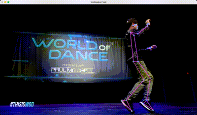

# Pose-Estimation-with-MediaPipe-Realtime
Easy to use 32 keypoints pose estimation on video feed or local video file in Python!

Below are instructions to implement in in your local system using a separate development environment using the [Conda](http://conda.pydata.org/docs/index.html) package management system which comes bundled with the Anaconda Python distribution provided by Continuum Analytics.

### Step 1:
[Fork and clone](https://github.com/siddharthksah/Pose-Estimation-with-MediaPipe) a copy of this repository on to your local machine.

### Step 2:
Create a `conda` environment called `pose-estimation` and install all the necessary dependencies, the environment.yml file is uploaded in the repo for ease:

    $ conda env create --file environment.yml
    
### Step 3:
Install the extra dependencies required to run the webapp smoother:

    $ pip install watchdog

### Step 4:
Activate the `pose-estimation` environment:

    $ source activate pose-estimation

To confirm that everything has installed correctly, type

    $ which pip

at the terminal prompt. You should see something like the following:

    $ ~/anaconda/envs/pose-estimation/bin/pip

which indicates that you are using the version of `pip` that is installed inside the `pose-estimation` Conda environment and not the system-wide version of `pip` that you would normally use to install Python packages.

### Step 5:
Change into your local copy of the this repo:

    $ cd Pose-Estimation-with-MediaPipe

### Step 6:
Run the webapp:

    $ streamlit run main.py

Inspired by https://www.youtube.com/watch?v=06TE_U21FK4&ab_channel=NicholasRenotte
